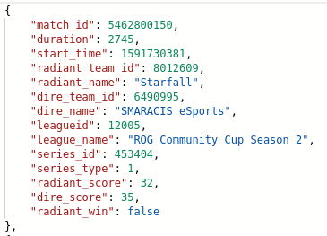
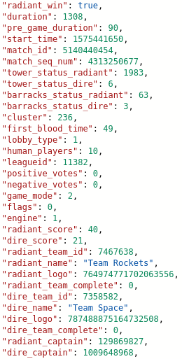
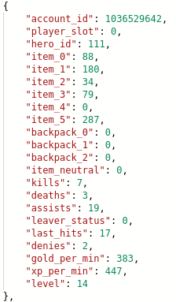
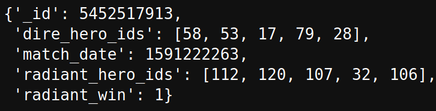

# Dota2-win-predictor-v2
Capstone 3

[Presentation Slides](https://docs.google.com/presentation/d/1-fivX6c4exI8K6wt5ukwtTWzkcjZ5DQ3KufQJtdfaxM/edit?usp=sharing)

## Objective
Build a full stack pipeline that pulls data daily to update a model.

### Methods

#### Data
I pulled my data from the [Steampowered API](https://dev.dota2.com/showthread.php?t=47115) and the [OpenDota API](https://docs.opendota.com/) which hold identical information but organized differently.

I used 2 apis even though it was possible to accomplish this task with one for a few reasons

- The Steampowered API specifically asked for users to limit their loads because it is free to use 

- The OpenDota API has the ability to specifically call professional matches but requires paid access for more calls

Example response to the /promatches route of the OpenDota API

Example response to the /get_match_detail route of the steampowered API

#### Storage
Matches are stored as JSON objects in a mongoDB running on a docker instance
 

#### Model

I used a tuned SK-Learn Random Forest Classifier to make predictions

More information on the model can be found [here](https://github.com/RellikDog/dota2-win-predictor) 